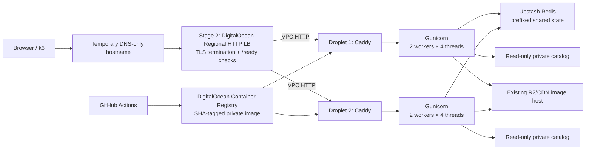

No files were modified. The plan below is based on the committed `UI-update` baseline at `9a136ea`, the current uncommitted worktree, repository history, and current DigitalOcean documentation/pricing.

The `grill-me` audit materially changed the plan in three places: it uncovered a catalog-confidentiality conflict in the working tree/history, made client-IP normalization a prerequisite for rate-limit testing, and identified Redis operations that are distributed but not fully atomic.

## 1. Repository findings

| Area | Finding |
|---|---|
| Backend entry point | [backend/app.py](C:/Users/Staff/Documents/GitHub/spartanguessr/backend/app.py:18) creates a module-level Flask application exported as `app:app`. Direct execution uses Flask’s development server, but Gunicorn can import the same object. |
| Application structure | One 578-line module owns configuration, routes, Redis access, locking, rate limiting, catalog selection, and leaderboard behavior. Models are in [backend/models.py](C:/Users/Staff/Documents/GitHub/spartanguessr/backend/models.py:9); catalog validation is in [backend/image_catalog.py](C:/Users/Staff/Documents/GitHub/spartanguessr/backend/image_catalog.py:14). |
| Gunicorn | `gunicorn==22.0.0` exists in [backend/requirements.txt](C:/Users/Staff/Documents/GitHub/spartanguessr/backend/requirements.txt:4), but there is no Gunicorn configuration, Dockerfile, Procfile, or committed start command. A deleted historical document suggested four workers, but it described an obsolete PostgreSQL design and should not be treated as current configuration. |
| Render | No `render.yaml` or other committed Render configuration exists, now or in history. The frontend defaults to `https://spartanguessr-by1x.onrender.com` in [src/utils/api.tsx](C:/Users/Staff/Documents/GitHub/spartanguessr/src/utils/api.tsx:1). Build/start settings, instance size, secret file, and environment values live outside the repository and must be recorded manually before comparison. |
| Environment | Required: `UPSTASH_REDIS_REST_URL`, `UPSTASH_REDIS_REST_TOKEN`, `IMAGE_CATALOG_PATH`, and `IMAGE_CDN_BASE_URL`. Operationally required: `ALLOWED_ORIGIN`. `PORT` is used only by direct Flask execution. The experiment should add `APP_VERSION`, `INSTANCE_ID`, `REDIS_KEY_PREFIX`, rate-limit settings, Gunicorn settings, and drain/readiness settings. |
| Redis use | `Redis.from_env()` creates the client. Redis stores session JSON, guess lists, the sorted-set leaderboard, fixed-window rate-limit counters, and session locks. Session/guess TTL is one hour. |
| Private catalog | The catalog is loaded synchronously at import from `IMAGE_CATALOG_PATH`, validated, and retained in process memory. The runtime returns opaque CDN object keys and reveals coordinates only after a guess. Migration documentation says the current Render catalog is a private secret file and images are stored on R2. |
| Health | `/health` always returns 200 once the application imports successfully. It does not check Redis. It currently passes through the global rate limiter. There is no readiness endpoint or version endpoint. |
| Rate limiting | Every route is limited to five requests per second per `request.remote_addr`. It fails open if Redis is unavailable. There is no `ProxyFix`; behind Caddy or a load balancer, users can collapse onto a proxy IP. |
| Tests | [backend/tests.py](C:/Users/Staff/Documents/GitHub/spartanguessr/backend/tests.py:1) contains 37 test functions covering TTLs, leaderboard behavior, validation, catalog secrecy, session creation, and basic rate limiting. `migrate/test_migrate.py` adds four migration tests. Missing: full game flow, real Redis integration, proxy headers, readiness, CORS, Redis outages, lock races, concurrent guesses, multi-replica behavior, and rollback smoke tests. One test is misleadingly named “24 hours” while correctly asserting 3,600 seconds. |
| Test execution | The suites were inspected but not run: the available bundled Python runtime lacks `pytest`, and installing dependencies would have exceeded this read-only planning phase. |
| GitHub Actions | No `.github` directory exists, and no workflow was found in repository history. |
| Frontend API and CORS | The frontend supports a compile-time `VITE_API_BASE_URL` override and otherwise continues to use Render. Requests use JSON and no cookies or credentials. Flask permits one configured origin plus localhost. An exact temporary frontend origin must be added for browser testing. |
| Replica readiness | Game state is already externalized to Upstash, so no sticky sessions are needed. All replicas must use the same catalog revision, CDN base, Redis endpoint, code SHA, and key-prefix policy. |
| Local filesystem | Runtime reads the catalog and optionally `.env`; it does not persist mutable game state locally. The migration utility writes files but is not part of serving. Deployment state, drain markers, logs, Docker data, and the catalog mount remain host-local operational data. |
| Reverse-proxy behavior | Only rate limiting currently depends on client IP. Host, scheme, or URL generation do not. Proxy misconfiguration can either make all users share a rate limit or permit spoofed IPs. |
| Distributed concurrency | The Redis lock acquisition is distributed. Lock release uses non-atomic `GET` then `DELETE`; an expired lock can be reacquired and then deleted by the previous owner. Guess-list and session updates are separate writes. Leaderboard qualification/add/trim/session marking are not one atomic transaction. |
| Branch/worktree | Current branch is `UI-update`, four commits ahead of `main`. The working tree contains unrelated edits and an untracked heatmap. The experiment should be created in a separate Git worktree from committed SHA `9a136ea`, avoiding both disruption and accidental inclusion of those changes. |

A critical repository finding: untracked [src/views/Heatmap.tsx](C:/Users/Staff/Documents/GitHub/spartanguessr/src/views/Heatmap.tsx:1) hardcodes a large set of game coordinates, and deleted `backend/image_map.json` versions remain in public Git history. Before claiming the catalog is confidential, confirm whether current opaque IDs/images were rotated and whether those historical coordinates still correspond to active images.

## 2. Risks and technical concerns

Priority order:

1. **Catalog confidentiality conflict:** do not carry `Heatmap.tsx` or coordinate data into the experiment branch. Treat the current catalog as confidential only after assessing historical exposure. Rotating opaque object keys/catalog records is the proper mitigation if old data is still usable.
2. **Client-IP/rate-limit failure:** without trusted-proxy handling, all users may share one five-RPS limit. Blindly trusting arbitrary `X-Forwarded-For` would permit rate-limit bypass.
3. **Secret lifecycle:** catalog contents, Upstash credentials, registry credentials, SSH keys, Terraform state, and TLS private keys must stay out of Git, images, cloud-init, screenshots, and logs.
4. **Lock release race:** replace `GET`/`DELETE` with an atomic compare-and-delete Lua script before multi-replica failure testing.
5. **Crash consistency:** a worker crash between `save_guess()` and `save_session()` can leave duplicated or inconsistent progress. Document and test this; making the entire round update atomic is a stretch goal unless tests demonstrate a material failure.
6. **Leaderboard races:** different sessions use different locks, so global top-50 operations can interleave. Add concurrency tests; use a Lua transaction or a dedicated short-lived leaderboard lock if failures are observed.
7. **Health checks are rate-limited:** liveness/readiness must bypass the user limiter.
8. **Experiment pollution:** sharing the production Upstash instance without a prefix could pollute rate-limit and leaderboard keys. Add `REDIS_KEY_PREFIX=spg:do-exp:<run-id>:` and never run destructive Redis tests against production keys.
9. **Load-test distortion:** the five-RPS/IP policy prevents a single generator from measuring capacity. Run a policy-on profile separately from capacity tests using a high rate-limit value on isolated experiment services.
10. **Sensitive access logs:** session IDs appear in query strings and URL paths. Do not log raw request URIs, query strings, bodies, environment values, or authorization data.
11. **Unpinned dependencies:** `upstash-redis` and Pillow are unpinned; `pytest` is currently bundled into production requirements.
12. **TLS/DNS dependency:** DigitalOcean-managed Let’s Encrypt certificates for regional load balancers require DigitalOcean-managed DNS. If the hostname is elsewhere, use a custom short-lived certificate or delegate only the experimental subdomain. [DigitalOcean SSL termination documentation](https://docs.digitalocean.com/products/networking/load-balancers/how-to/ssl-termination/)
13. **Two-day timing:** provision and validate on July 29, benchmark July 30, and destroy early July 31. Do not rely on the exact credit-expiration hour.

## 3. Recommended target architecture

Use Caddy because Stage 1 benefits from automatic HTTPS and its trusted-proxy support. Caddy should normalize the trusted client address into one sanitized `X-Forwarded-For` value; Flask then always uses `ProxyFix(x_for=1, x_proto=1)`.



Stage 1 omits the load balancer and points the temporary hostname directly to one Droplet. Stage 2 terminates TLS at the load balancer, forwards over the VPC to Caddy, and restricts backend HTTP to the load balancer.

Recommended initial Gunicorn configuration:

- Worker class: `gthread`
- Workers: `2`
- Threads per worker: `4`
- Bind: `0.0.0.0:8000` inside the Docker network only
- Timeout: 30 seconds
- Graceful timeout: 30 seconds
- Keepalive: 5 seconds
- `max_requests=1000`, jitter 100
- Access logs disabled in favor of application route-template logs
- Error logs and captured stdout/stderr sent to container stdout

This is only a starting point. Benchmark 1×4, 2×2, 2×4, and 4×2 arrangements on appropriate Droplets.

Client-IP design:

- Stage 1 DNS-only: Caddy receives the real peer and replaces untrusted incoming forwarded headers.
- Stage 2: the Cloud Firewall accepts backend HTTP only from the load balancer; Caddy trusts only the VPC/load-balancer range, extracts the load balancer’s forwarded client IP, then sends one sanitized value to Flask.
- Flask trusts exactly one Caddy-generated value with `x_for=1`; do not trust forwarded host, port, or prefix.
- Cloudflare-proxied DNS is not the default. Supporting it requires Cloudflare CIDR allowlisting and `CF-Connecting-IP` handling; otherwise the application sees a Cloudflare edge IP.
- Caddy ignores incoming forwarded headers by default unless their sender is explicitly trusted, which is the desired security baseline. [Caddy reverse-proxy documentation](https://caddyserver.com/docs/caddyfile/directives/reverse_proxy)
- DigitalOcean injects forwarded headers only for HTTP or terminated TLS, not TLS passthrough. [DigitalOcean load-balancer limits](https://docs.digitalocean.com/products/networking/load-balancers/details/limits/)

## 4. Proposed branch and file structure

Create a clean worktree from the committed baseline:

```powershell
git worktree add ..\spartanguessr-do-exp `
  -b experiment/digitalocean-droplet-backend `
  9a136ea
```

Recommended structure:

```text
backend/
  Dockerfile
  .dockerignore
  gunicorn.conf.py
  requirements.in
  requirements.lock
  requirements-dev.in
  requirements-dev.lock
  redis_scripts.py
  app.py
  tests.py

compose.yaml

infra/
  caddy/
    Caddyfile
  terraform/
    versions.tf
    providers.tf
    locals.tf
    variables.tf
    data.tf
    network.tf
    compute.tf
    firewall.tf
    load-balancer.tf
    registry.tf
    monitoring.tf
    dns.tf
    outputs.tf
    terraform.tfvars.example
    README.md
  cloud-init/
    cloud-config.yaml.tftpl
  scripts/
    upload-catalog.ps1
    deploy.sh
    smoke-test.sh
    collect-host-evidence.sh
    destroy.ps1
    verify-cleanup.ps1

.github/
  workflows/
    backend-ci.yml
    deploy-digitalocean.yml

load-tests/
  README.md
  k6/
    game-flow.js
    rate-limit.js
    smoke.js
    lib/
      api.js
      metrics.js

docs/experiments/digitalocean-droplet/
  README.md
  architecture.md
  decision-log.md
  benchmark-plan.md
  benchmark-results.md
  failure-test-plan.md
  incident-report.md
  render-comparison.md
  cost-report.md
  cleanup-checklist.md
  demo-script.md
  artifacts/
    README.md
```

Artifact names:

```text
2026-07-30T1900Z_sfo3_basic-2vcpu-4gb_single_<sha7>_run-01/
  manifest.json
  k6-summary.json
  metrics.csv
  deployment-redacted.log
  timeline.md
  screenshots/
```

Commit summaries and compressed raw data, not multi-gigabyte k6 streams. Every artifact directory gets a manifest containing SHA, target configuration, workload version, timestamps, generator location, rate-limit mode, catalog revision identifier, and known limitations.

## 5. Ordered implementation phases

### Phase 0 — Isolate the branch and establish gates

- **Goal:** clean experiment branch with no heatmap or unrelated user edits.
- **Files affected:** none initially; later experiment README and decision log.
- **Commands:** `git worktree add`, `git status`, `git diff --check`.
- **Verification:** branch points to `9a136ea`; worktree is clean; coordinate-bearing untracked files are absent.
- **Evidence:** baseline SHA, clean `git status`, preflight checklist.
- **Rollback:** remove only the new worktree and unpushed branch.
- **Effort:** Small, 30–45 minutes.

Preflight gates: remaining credit amount, DO resource limits, available registry, SSH/admin CIDR, Upstash region, controlled hostname, DNS provider, current Render plan/start command, and catalog source.

### Phase 1 — Backend production and replica safety

- **Goal:** trusted client IPs, readiness, namespaced Redis, atomic unlock, safe logging, configurable limits.
- **Files affected:** `backend/app.py`, `backend/redis_scripts.py`, `backend/tests.py`, dependency files.
- **Commands:** install dev lock; run `pytest`; run lint/compile checks.
- **Verification:** proxy-spoof tests, health/readiness tests, Redis-prefix tests, concurrent-lock tests, full game-flow tests.
- **Evidence:** JUnit XML, coverage summary if added, test log.
- **Rollback:** revert application commits; no infrastructure exists yet.
- **Effort:** Medium, 2.5–3 hours.

### Phase 2 — Reproducible container and local Compose

- **Goal:** non-root SHA-tagged Gunicorn container behind Caddy.
- **Files affected:** Dockerfile, `.dockerignore`, `gunicorn.conf.py`, `compose.yaml`, Caddyfile.
- **Commands:** `docker build`, `docker compose config --quiet`, `docker compose up -d`, local smoke tests.
- **Verification:** non-root UID, catalog is read-only, app port not host-public, health check passes, graceful stop succeeds, image contains no secret/catalog files.
- **Evidence:** `docker inspect` excerpts, image digest/size, local smoke result.
- **Rollback:** `docker compose down`; remove local experiment images.
- **Effort:** Medium, 1.5–2 hours.

### Phase 3 — Terraform and hardened single Droplet

- **Goal:** reproducible Stage 1 with VPC, Droplet, firewall, monitoring, registry, DNS, and HTTPS.
- **Files affected:** all `infra/terraform`, cloud-init, upload and smoke scripts.
- **Commands:** `terraform fmt`, `init`, `validate`, `plan`, reviewed `apply`; catalog upload; initial deploy.
- **Verification:** SSH hardening, UFW and cloud firewall, time sync, unattended upgrades, monitoring data, reboot recovery, external `/health` and `/ready`.
- **Evidence:** sanitized plan, architecture screenshot, monitoring screenshot, firewall rules, TLS report.
- **Rollback:** point temporary DNS nowhere or back to Render, then reviewed Terraform destroy.
- **Effort:** Large, 3–4 hours.

### Phase 4 — CI/CD and rollback

- **Goal:** test, build, push, deploy by SHA, readiness gate, automatic rollback.
- **Files affected:** GitHub workflows and `infra/scripts/deploy.sh`.
- **Commands:** workflow dispatch; deliberately deploy unhealthy SHA.
- **Verification:** successful deployment records SHA; failed readiness restores previous digest; secrets absent from logs.
- **Evidence:** redacted workflow log, deployed-version response, rollback timeline.
- **Rollback:** redeploy prior SHA; Render remains untouched.
- **Effort:** Medium/Large, 2.5–3 hours.

### Phase 5 — Two replicas and rolling deployment

- **Goal:** two identical Droplets behind a regional HTTP load balancer with zero planned deployment interruption.
- **Files affected:** Terraform replica/LB resources, readiness drain behavior, workflow host loop.
- **Commands:** set `replica_count=2`, enable LB, plan/apply; rolling workflow.
- **Verification:** alternating node identities, shared sessions, no sticky sessions, one node drained and replaced at a time.
- **Evidence:** LB health screenshot, probe timeline, both node SHAs, traffic-distribution log.
- **Rollback:** restore previous SHA per node; disable LB and return temporary DNS to Stage 1 or Render.
- **Effort:** Large, 3 hours.

### Phase 6 — Benchmarks, failures, reporting, cleanup

- **Goal:** defensible measurements and a verified zero-resource teardown.
- **Files affected:** load tests and experiment documentation/artifacts.
- **Commands:** k6 profiles, failure scripts, cost export, destroy and verification scripts.
- **Verification:** repeated runs, generator not saturated, results labeled, all failures recovered, no billable resources remain.
- **Evidence:** benchmark/failure/cost artifacts and cleanup screenshots.
- **Rollback:** stop load generator immediately; restore last healthy SHA; preserve Render endpoint.
- **Effort:** Large, 6–8 hours spread across the experiment.

Essential work is Phases 0–6 through the two-replica failure tests. Snapshot restore, reserved-IP failover, very large Droplets, remote Terraform state, and Cloudflare-proxy support are stretch goals.

## 6. File-by-file change plan

| File | Planned change |
|---|---|
| `backend/app.py` | Add provider-neutral configuration validation, `ALLOWED_ORIGINS`, `REDIS_KEY_PREFIX`, configurable rate limits, `ProxyFix`, safe route-template request logs, `APP_VERSION`, `/ready`, drain handling, health/rate-limit exemptions, finite coordinate validation, and provider-neutral Redis errors. |
| `backend/redis_scripts.py` | Atomic compare-and-delete lock release. Add a leaderboard Lua operation only if concurrency tests justify it. |
| `backend/tests.py` | Add proxy-hop/spoofing, CORS, liveness/readiness, namespace, Redis-outage, full-flow, double-submit, atomic unlock, graceful error, and version tests. Correct misleading TTL test name. |
| `backend/requirements.in` | Direct production dependencies only. |
| `backend/requirements.lock` | Fully resolved, hash-locked production dependencies generated by `pip-compile`. |
| `backend/requirements-dev.*` | Pytest, pip-tools, and optional coverage/security tooling separate from production. |
| `backend/Dockerfile` | Pinned Python 3.12 slim digest; wheel builder; non-root UID/GID 10001; copy only runtime; `HEALTHCHECK`; exec-form Gunicorn command; no secrets. |
| `backend/.dockerignore` | Exclude Git, `.env*`, catalogs, tests from final context where appropriate, caches, migration output, docs, and artifacts. |
| `backend/gunicorn.conf.py` | Environment-driven worker/thread configuration, timeouts, stdout error logging, graceful shutdown, no raw URI access log. |
| `compose.yaml` | Backend+Caddy network, catalog `:ro`, env file, restart policy, health dependency, log rotation, `stop_grace_period`, no exposed port 8000. |
| `infra/caddy/Caddyfile` | HTTPS/direct Stage 1 mode and HTTP/LB Stage 2 mode; trusted-proxy normalization; security headers; no sensitive URI logs; reverse proxy to backend. |
| Terraform files | Provider/version pins, dedicated VPC, tag-based droplets, firewall, optional registry, monitoring alerts, optional LB/certificate/DNS, outputs and validations. |
| Cloud-init template | Harden Ubuntu 24.04 LTS, create admin/deploy users, install Docker and monitoring agent, configure SSH/UFW/unattended upgrades/time sync/log limits, create secure directories. |
| `upload-catalog.ps1` | Verify SSH fingerprints, upload catalog without printing it, set owner/mode, record only checksum/revision, repeat across replicas. |
| `deploy.sh` | Pull exact SHA, retain previous SHA, drain, deploy, probe local readiness, rollback on failure, record current image. |
| Workflows | CI plus protected deployment environment, SHA image tags, DOCR push, sequential rolling deployment, evidence artifact. |
| `src/utils/api.tsx` | No default change required. Document/build a temporary frontend preview with `VITE_API_BASE_URL`; Render remains the fallback. |
| Load-test files | Reusable complete-flow workload and separate rate-limit correctness workload. |
| Experiment docs | Pre-filled templates, decision log, commands, expected evidence, blank result tables, cleanup proof, and demo script. |
| `.gitignore` | Add Terraform state/plans, secret/env files, benchmark raw streams, local k6 output, and generated credentials while allowing sanitized summaries. |

## 7. Infrastructure resource plan

Use Terraform provider version pinning and these resources where enabled: `digitalocean_vpc`, `digitalocean_tag`, `digitalocean_ssh_key`, `digitalocean_droplet`, `digitalocean_firewall`, `digitalocean_monitor_alert`, `digitalocean_loadbalancer`, `digitalocean_certificate`, `digitalocean_record`, and optionally `digitalocean_container_registry`. These resources are currently supported by the official provider. [DigitalOcean Terraform resource reference](https://docs.digitalocean.com/reference/terraform/reference/resources/)

Suggested variables:

```text
experiment_id
expires_on
region
vpc_cidr
droplet_image
droplet_size
replica_count
enable_load_balancer
enable_dns
dns_zone
api_hostname
admin_cidrs
ssh_public_key_path
registry_name
registry_plan
container_repository
app_port
rate_limit_requests
rate_limit_seconds
redis_key_prefix
monitoring_email
```

Recommended defaults:

- `experiment_id = "spg-do-exp-202607"`
- `expires_on = "2026-07-31"`
- `region = "sfo3"` unless Upstash’s region makes another location materially better
- `image = "ubuntu-24-04-x64"`
- `size = "s-1vcpu-1gb"`
- `replica_count = 1`
- VPC CIDR selected only after checking account-wide overlap
- Tags: `project:spartanguessr`, `env:experiment`, `managed-by:terraform`, `expires:2026-07-31`

State strategy:

- Local Terraform state on an encrypted workstation is adequate for one operator and two days.
- Add all state and plan files to `.gitignore`.
- Keep one encrypted offline backup until cleanup is verified.
- Never put secrets in variables, cloud-init, source, or state.
- Provider reads `DIGITALOCEAN_TOKEN` from the environment.
- If collaboration requires shared state, HCP Terraform is a stretch goal; do not add Spaces solely for state.

Safeguards:

- Manage a dedicated project and experiment-prefixed resources.
- Treat existing registries, DNS zones, and SSH keys as data sources, not resources to destroy.
- DO accounts may have only one Starter/Basic registry; preflight with `doctl registry get`.
- Validate `experiment_id` and `expires_on` through Terraform preconditions.
- Generate a destroy plan and inspect every address before applying it.
- Cleanup scripts may enumerate by exact tag, but must not mass-delete by tag without explicit resource-ID confirmation.

Expected commands:

```powershell
terraform -chdir=infra/terraform init
terraform -chdir=infra/terraform fmt -check
terraform -chdir=infra/terraform validate
terraform -chdir=infra/terraform plan `
  -var-file=experiment.tfvars `
  -out=tfplan
terraform -chdir=infra/terraform apply tfplan
```

No volume is recommended: the service is stateless, and a volume cannot serve as shared catalog storage across both replicas. No NAT gateway is justified.

## 8. Security plan

Private catalog:

- Simplest secure approach: one-time `scp` from a trusted workstation to each Droplet.
- Destination: `/opt/spartanguessr/secrets/image_catalog.json`.
- Host owner/mode: `root:spgdeploy`, `0440`; directory `0750`.
- Container mount: `/run/secrets/image_catalog.json:ro`.
- Fixed container GID maps to the host group.
- Upload script validates host keys and prints only success, byte count, and SHA-256 revision.
- Catalog is never put in GitHub Secrets, Terraform, cloud-init, a registry image, or deployment logs.
- A replacement Droplet is not ready until the expected catalog revision is uploaded.

Host:

- Non-root `spgadmin` user with SSH key and sudo.
- Separate minimally privileged `spgdeploy` user for Docker deployment.
- Disable password authentication, root login, and empty passwords.
- Install unattended security updates.
- Use official Docker apt repository and Compose plugin.
- Enable `systemd-timesyncd`.
- Configure journald/Docker log retention and disk alerts.
- UFW default deny; SSH only from administrative CIDRs.
- Docker can bypass UFW for published ports, so never publish backend port 8000.
- `restart: unless-stopped`; verify recovery after host reboot.

Cloud Firewall:

- Stage 1: 22 from admin CIDRs; 80/443 from the internet; outbound DNS, NTP, HTTP/HTTPS as needed.
- Stage 2: 22 from admin CIDRs; backend HTTP only from the load-balancer UID/VPC; no direct public application traffic. The Terraform provider supports `source_load_balancer_uids`. [DigitalOcean firewall resource](https://docs.digitalocean.com/reference/terraform/reference/resources/firewall/)
- Cloud Firewalls are stateful and free. [DigitalOcean firewall pricing](https://docs.digitalocean.com/products/networking/firewalls/details/pricing/)

Application/CI:

- Exact CORS origins only; no wildcard.
- Rate-limit health endpoints separately/exempt them.
- Constant code/catalog/config across replicas.
- SHA tags only; no deployment from `latest`.
- Pin third-party actions by commit SHA.
- Protected GitHub `digitalocean-experiment` environment with manual approval.
- Use experiment-specific SSH and DO credentials; rotate/delete them on cleanup.
- Disable shell tracing around secrets.
- Do not run `docker compose config` without `--quiet`.
- Scan the image and dependencies; save the summary without sensitive paths.
- Redact session IDs, client IPs, URLs containing query strings, and tokens from evidence.

## 9. CI/CD plan

Triggers:

- `backend-ci.yml`: pull requests and pushes affecting backend/container/infra.
- `deploy-digitalocean.yml`: manual dispatch and optionally pushes to the experiment branch after environment approval.
- Deployment inputs: SHA, stage, host set, expected catalog revision, rollback SHA override.

Pipeline:

1. Check out exact SHA.
2. Set up Python 3.12.
3. Install `requirements-dev.lock` with hashes.
4. Run backend and migration tests; upload JUnit results.
5. Validate Docker build and Terraform formatting/validation.
6. Build the backend image.
7. Tag `registry.digitalocean.com/<registry>/spartanguessr-backend:<full-sha>`.
8. Scan it and push it to DOCR.
9. Obtain short-lived registry credentials without echoing them.
10. Deploy Stage 1 or roll Stage 2 sequentially.
11. Drain node by making `/ready` return 503.
12. Wait for the LB to remove it, while public probes confirm the other node serves.
13. Pull the exact SHA; start it; poll local `/health` and `/ready`.
14. Remove drain and wait for LB health.
15. Proceed to the next node only after the first is healthy.
16. If readiness fails, redeploy the recorded previous SHA and stop.
17. Record SHA, image digest, node, timestamps, and readiness latency.

Availability comes from one healthy node remaining in service while the other is drained. No schema migration is planned, so mixed old/new versions during rolling deployment remain compatible.

Required secrets/variables:

- `DIGITALOCEAN_ACCESS_TOKEN`
- `DO_SSH_PRIVATE_KEY`
- `DO_KNOWN_HOSTS`
- `DO_REGISTRY_NAME`
- Deployment host IDs/IPs as environment variables or Terraform-derived protected configuration
- No Upstash token or catalog is needed by the image-build job

Render rollback is immediate because the live frontend continues to default to Render. The DigitalOcean experiment uses a separate hostname or frontend preview.

## 10. Functional test plan

Ordered matrix:

1. `/health` returns 200 without touching Redis; includes SHA but no secrets.
2. `/ready` returns 200 only with catalog, required configuration, and Redis available.
3. Missing catalog prevents a worker from becoming ready.
4. Redis outage leaves `/health` at 200 and changes `/ready` to 503.
5. Allowed frontend origin receives correct CORS headers; an unrelated origin does not.
6. Direct spoofed `X-Forwarded-For` is discarded by Caddy.
7. Six quick requests from one real client produce five successes and one 429.
8. Two distinct forwarded clients receive independent counters in trusted-proxy tests.
9. Create a normal session with each difficulty/round-count combination.
10. Request an image; verify URL contains an opaque object key and no coordinate-form filename.
11. Repeat the same image request; verify idempotent active-round behavior.
12. Submit valid guesses through all rounds.
13. Retrieve results and reconcile total/round scores.
14. Verify returned coordinates appear only after guess submission.
15. Create leaderboard mode; verify hard/five-round/server-generated seed behavior.
16. Complete it, check qualification, submit a name, retrieve leaderboard.
17. Reject duplicate submission and client-supplied scores.
18. Reject missing bodies, invalid difficulty, wrong round, strings/NaN/infinite/out-of-map coordinates, oversized names, and unknown sessions.
19. Alternate each request of one session between Droplet 1 and Droplet 2; results must be identical.
20. Send two concurrent guesses for one round; exactly one state transition is stored.
21. Make Redis unavailable; game requests return controlled JSON 503 responses and recover without corrupted state.
22. Reboot a host and verify Docker/Caddy/application recover without manual intervention.

## 11. Load-test plan

Use k6.

Primary full-flow scenario per virtual user:

1. `POST /session`
2. For five rounds:
   - `GET /random-image`
   - 1–3 second think time
   - `POST /guess` with a valid randomized map coordinate
3. `GET /session/<id>/results`
4. Optional `GET /leaderboard`

Do not submit leaderboard writes against production Redis. If tested, use an isolated Redis prefix and generated names.

Profiles:

| Profile | Purpose |
|---|---|
| Smoke | 1 VU, one complete game; deployment gate. |
| Policy-on | Default five-RPS/IP limit; verify user-visible latency and 429 behavior. |
| Baseline | 1–5 paced VUs; cold/warm latency without saturation. |
| Ramp | 5→25→50→100 VUs, stopping at error/SLO threshold. |
| Soak | 30–60 minutes below saturation; detect leaks and shared-CPU variability. |
| Spike | Brief 2× known sustainable concurrency; measure recovery. |
| Capacity | Isolated target with a documented high rate-limit value; infrastructure capacity, not production policy. |

Configurations:

1. 1× Basic 1 vCPU/1 GiB — minimum viable memory and shared-CPU baseline.
2. 1× Basic 2 vCPU/4 GiB — effect of shared-CPU scale-up.
3. 1× CPU-Optimized 2 vCPU/4 GiB — dedicated versus shared CPU at similar core/RAM shape.
4. 2× Basic 1 vCPU/1 GiB + LB — horizontal scaling versus one small instance.
5. 2× Basic 2 vCPU/4 GiB + LB — higher-capacity horizontal configuration.
6. Stretch: 1× and 2× CPU-Optimized 4 vCPU/8 GiB, only if smaller runs approach CPU saturation.

For every run capture:

- RPS and completed games/minute
- Concurrent VUs
- p50/p95/p99 per operation and full game
- HTTP error, 409, 429, and 500 rates
- Droplet CPU, memory, load, disk, network
- LB healthy-node count/traffic
- Redis request latency when observable
- Generator CPU/memory; discard runs where generator CPU exceeds 70–80%
- Cold start, warmup duration, steady-state window, cooldown
- SHA, worker/thread configuration, rate-limit mode, generator location

Fairness:

- Use the same k6 source, generator, schedule, dataset, and public-network path for Render and DO.
- Randomize target order between repeated runs.
- Run at least three repetitions.
- Compare medians and spread, not the best run.
- Do not run capacity traffic against the live Render backend without explicit operational permission.
- If a matching temporary Render service cannot be created, limit Render comparison to safe low-rate profiles and label raw DO capacity as non-comparable.

## 12. Failure-test plan

| Test | Procedure | Expected/metrics/success | Recovery and evidence |
|---|---|---|---|
| Kill app container | `docker kill` only the experiment backend while probing at 1 Hz. | Single node: transient failure then restart. Two nodes: LB removes it; target <1% probe errors and recovery under 60s. | Verify restart policy and readiness; save probe CSV, Docker events, monitoring screenshot. |
| Restart Docker | Drain node, `sudo systemctl restart docker`, then undrain. | Other node stays available; services recover automatically. Measure drain, restart, ready, and rejoin times. | Start Docker if needed; deploy prior SHA; save system journal excerpt. |
| Reboot Droplet | Drain one node and reboot over SSH. | LB keeps traffic on survivor; rebooted host automatically rejoins. | Console recovery if SSH fails; save uptime, boot timeline, LB screenshot. |
| Destroy one replica | Destroy only a selected Terraform-managed replica during continuous load. | LB serves through remaining node; shared sessions continue. Measure error rate and detection time. | Re-apply exact Terraform plan, upload catalog, deploy SHA; save plan and restoration time. |
| Prevent Redis access | On a drained experiment node, add a narrowly scoped, time-bounded host rule blocking the resolved Upstash IP; use a cleanup trap. | `/health` 200; `/ready` 503; game operations fail cleanly; no data corruption. | Remove exact rule, verify ready within 60s; save timestamps and sanitized errors. |
| Unhealthy image | Deploy a test SHA whose readiness deliberately fails, through workflow dispatch. | Workflow never proceeds to node 2; node 1 returns to previous SHA within five minutes; public service stays available. | Automatic rollback, then manual prior-SHA dispatch if needed; save workflow log. |
| CPU pressure | Run a disposable `stress-ng` container with explicit CPU limits. | Latency degrades predictably; no host crash; service returns to baseline after stop. | Container auto-removes; save CPU/p95 time series. |
| Memory pressure | Run a limited container consuming no more than a precomputed safe portion of free RAM; never invoke unbounded OOM tests. | Memory alert or degradation occurs; backend remains recoverable. | Stop pressure container; verify no swap/disk spiral; save memory graph. |
| Rolling deploy | Continuous complete-game workload during sequential drain/deploy. | No session loss; no planned downtime; old/new SHA overlap documented. | Roll back one node at a time; save probe and node-version timeline. |

No destructive experiment may target Render, production Redis keys, R2, or infrastructure not tagged for this experiment.

## 13. Render comparison methodology

| Dimension | Measurement |
|---|---|
| Deployment effort | Stopwatch operator minutes, manual steps, secrets/config steps, and failed attempts from clean start to ready. |
| Operational responsibility | Control-by-control inventory: OS, patching, TLS, firewall, process supervision, logs, scaling, backups, rollback. |
| Cold start | Ten first-request measurements after verified idle/start conditions. Do not assume Render spins down; record plan behavior. |
| Baseline latency | Same generator, low paced load, same endpoints, three runs. |
| Load latency/throughput | Same full-flow scenario and rate-limit mode. |
| Failure recovery | DO controlled tests versus only safe/authorized Render restart/redeploy tests. |
| Deployment downtime | External 1 Hz probe from deploy start until stable ready. |
| Rollback | Trigger-to-previous-SHA-ready duration and operator actions. |
| Observability | Available metrics, retention, logs, alerts, and effort to correlate incidents. |
| Monthly cost | Actual Render invoice/plan versus normalized DO monthly caps plus LB/registry; hold Upstash/R2 constant. |
| Two-day cost | DigitalOcean billing CSV and resource-hour ledger. |
| Security | Managed controls versus owner-operated responsibilities. |
| Scaling | Time, steps, downtime, and behavior to add/remove a replica. |

Avoid “DO is faster” as a hypothesis. The defensible outcome may be that Render is operationally superior while DO provides more control, failure-testing access, or better predictable warm latency.

## 14. Metrics and evidence collection

Preserve:

- Terraform source and sanitized plans
- Dockerfile, lockfiles, image digest and scan summary
- Caddy/Gunicorn configuration
- CI/CD logs with secrets/session IDs removed
- JUnit results
- k6 source, summary JSON, CSV metrics, and run manifests
- DO Monitoring and LB health screenshots
- Deployment and rollback timelines
- Failure-test timelines and recovery evidence
- Architecture diagrams and decisions
- Actual cost CSV/screenshot
- Render comparison and limitations
- Cleanup dashboard screenshots
- Three-to-five-minute demo script

Application logs should use route templates such as `/session/<session_id>/results`, never concrete paths or query strings. Recommended fields:

```text
timestamp
request_id
method
route_template
status
duration_ms
app_version
instance_id
```

DigitalOcean Monitoring is free and supports CPU, memory, disk, load, bandwidth, and alerts when the agent is installed. [Monitoring details](https://docs.digitalocean.com/products/monitoring/details/)

Resume-relevant measurements:

- Sustainable completed games/minute and RPS
- p95 and p99 end-to-end/game-operation latency
- Maximum tested concurrent users under an agreed error threshold
- Single-to-dual-replica throughput/latency change
- Container and Droplet failure recovery time
- Planned deployment downtime
- Automatic rollback time
- Actual and normalized monthly cost
- Number of automated infrastructure, deployment, and security controls

## 15. Two-day execution schedule

### July 28 evening — preflight only

- Record credit balance and expiry details.
- Confirm hostname/DNS control, DO account limits, Upstash region, catalog source, admin CIDR, and Render plan/start command.
- Protect or commit unrelated frontend work separately.
- Do not provision billable resources yet.

### July 29 — Stage 1

- 08:00–09:00: clean worktree/branch and decision log.
- 09:00–12:00: backend safety changes, locks, health/readiness, tests.
- 12:00–14:00: Docker, Compose, Caddy, local smoke tests.
- 14:00–17:00: Terraform, cloud-init, registry, catalog upload, DNS/HTTPS.
- 17:00–19:00: CI/CD, unhealthy-image rollback test.
- 19:00–21:00: functional matrix and single-node baseline.
- End of day: verify budget, save evidence, no unexplained unhealthy alerts.

### July 30 — Stage 2 and experiments

- 08:00–10:30: second replica, LB, trusted-proxy validation.
- 10:30–12:00: rolling deployment under probe/load.
- 12:00–15:00: container, Docker, reboot, replica-loss, Redis tests.
- 15:00–20:00: benchmark configurations, repeated runs, Render-safe comparison.
- 20:00–22:00: reports, incident write-up, demo recording.
- Destroy ephemeral high-capacity configurations immediately after their run.

### July 31 — cleanup buffer

- 08:00: export final billing/resource inventory.
- 09:00: final demo/checkpoint.
- 10:00: Terraform destroy.
- 11:00: manual cleanup audit.
- Noon: second dashboard/API verification that no billable resource remains.

Do not postpone destruction until the advertised credit-expiration time.

## 16. Estimated credit usage

Current official rates include per-second Droplet billing with a 60-second or $0.01 minimum. Powered-off Droplets continue billing until destroyed. [Droplet pricing](https://docs.digitalocean.com/products/droplets/details/pricing/)

| Resource | Current price | Example experiment cost |
|---|---:|---:|
| Basic 1 vCPU/1 GiB | $0.00893/hour | 24 h ≈ $0.21 |
| Basic 2 vCPU/4 GiB | $0.03571/hour | 4 h ≈ $0.14 |
| CPU-Optimized 2 vCPU/4 GiB | $0.06250/hour | 3 h ≈ $0.19 |
| 2× Basic 1 vCPU/1 GiB | $0.01786/hour | 8 h ≈ $0.14 |
| 2× Basic 2 vCPU/4 GiB | $0.07142/hour | 6 h ≈ $0.43 |
| CPU-Optimized load generator | $0.06250/hour | 10 h ≈ $0.63 |
| Regional HTTP LB, one node | $12/month, hourly prorated | 24 h ≈ $0.43 approximation |
| DOCR Basic | $5/month | Budget $5 |
| Snapshot | $0.06/GB-month, $0.01 minimum | Usually $0.01–$0.05 briefly |
| VPC traffic in one datacenter | Free | $0 |
| Cloud Firewall | Free | $0 |
| Monitoring | Free | $0 |
| Reserved IPv4 | Free while assigned; $0.01/hour unassigned | Optional; delete promptly |
| Block volume | $0.10/GiB-month even when detached | Not recommended |

Droplet size rates come from the current [DigitalOcean Droplet price table](https://www.digitalocean.com/pricing/droplets). Regional HTTP load balancers are $12/month per node and prorated by time. [Load-balancer pricing](https://docs.digitalocean.com/products/networking/load-balancers/details/pricing/) DOCR Basic provides 5 GiB for $5/month; the storage allowance is prorated for short-lived registries, so retain only a few SHA images and garbage-collect untagged layers. [Container Registry pricing](https://docs.digitalocean.com/products/container-registry/details/pricing/)

Baseline budget: approximately **$7.2**, dominated by DOCR Basic. Actual billing may differ by registry billing treatment, snapshot utilization, bandwidth, and run duration; use the dashboard as authoritative.

If the remaining credit balance is substantial, use it productively:

1. Repeat each configuration enough times to obtain stable p95/p99 measurements.
2. Add a 4-vCPU CPU-Optimized single/pair comparison.
3. Add an 8-vCPU configuration only if 4-vCPU runs remain CPU-bound.
4. Add a second geographically distinct load generator.
5. Stop scaling when Upstash/network latency or the generator becomes the bottleneck.

Do not keep idle servers merely to consume credits. Do not add volumes, NAT gateways, or managed databases unrelated to the architecture.

Resources that continue billing after a Droplet is powered off or destroyed include powered-off-but-existing Droplets, load balancers, volumes, snapshots, registries/plans, and unassigned reserved IPv4 addresses. Volumes bill even while detached. [Volume pricing](https://docs.digitalocean.com/products/volumes/details/pricing/) Reserved-IP terms are documented here: [Reserved IP pricing](https://docs.digitalocean.com/products/networking/reserved-ips/details/pricing/).

## 17. Cleanup and rollback plan

Application rollback:

- Each host records current and previous image SHA/digest.
- Failed readiness automatically restores the previous image.
- Stage 2 rollback is sequential and drained.
- Temporary frontend remains able to switch `VITE_API_BASE_URL` to Render.
- Production frontend and Render DNS are never changed by default.

Infrastructure destruction:

```powershell
terraform -chdir=infra/terraform plan `
  -destroy `
  -var-file=experiment.tfvars `
  -out=destroy.tfplan

terraform -chdir=infra/terraform show destroy.tfplan
terraform -chdir=infra/terraform apply destroy.tfplan
```

Cleanup checklist:

- Droplets destroyed, not merely powered off
- Regional load balancer destroyed
- No block volumes
- Droplet/volume snapshots deleted
- Reserved IPv4 released
- DOCR image tags and untagged layers removed
- Registry plan downgraded/destroyed if created solely for the experiment
- Cloud Firewall removed
- Monitoring alerts removed
- Temporary DNS record removed
- Temporary certificate removed
- VPC removed
- Terraform-created project/tags removed where safe
- Experiment SSH key removed from DO and GitHub
- GitHub deployment environment secrets rotated/deleted
- Temporary DO API token revoked
- Catalog copies securely deleted with the hosts
- Any manual resources added to a ledger and removed
- Terraform state retained only in encrypted offline storage until verification
- DigitalOcean dashboard billing/resource pages show no experiment resource
- `doctl` inventory agrees with the dashboard
- Final screenshot and timestamp added to `cleanup-checklist.md`

`verify-cleanup.ps1` should list, but not automatically delete, resources matching the exact experiment prefix/tag. This prevents a broad cleanup command from damaging unrelated infrastructure.

## 18. Resume-bullet templates

- Deployed a containerized Flask/Gunicorn backend to DigitalOcean using Terraform, Caddy, HTTPS, cloud firewalls, monitoring, and GitHub Actions, sustaining **[RPS] RPS / [concurrent users] users** at **[p95] ms p95** for complete game flows.

- Designed and tested a two-Droplet stateless architecture behind a managed load balancer, improving **[throughput or latency metric] by [percentage]** over one Droplet while recovering from container and host failures in **[recovery time]** with **[error rate]** errors.

- Built SHA-based rolling deployments with readiness gates and automatic rollback, achieving **[deployment downtime]** deployment downtime and **[rollback time]** rollback recovery while documenting a Render-versus-IaaS cost/operations comparison of **[$X actual / $Y normalized monthly]**.

## 19. Definition of done

Essential completion requires:

- Clean experiment branch based on a committed baseline
- No catalog/coordinate data in source, images, CI logs, Terraform, or artifacts
- Reproducible non-root backend image running Gunicorn
- Caddy reverse proxy and verified HTTPS
- Correct trusted client IP and rate limiting
- Separate liveness and readiness behavior
- Atomic distributed lock release
- Redis key namespace isolated from production
- Passing backend, proxy, readiness, full-flow, and concurrency tests
- Terraform-provisioned VPC, Droplet(s), firewall, monitoring, and LB
- Hardened Ubuntu host recovering after reboot
- Private DOCR image tagged by commit SHA
- CI/CD deployment with readiness gating and proven rollback
- Complete Stage 1 and Stage 2 functional tests
- At least four meaningful benchmark configurations with repeated full-flow runs
- Container, Docker, reboot, Droplet-loss, Redis, unhealthy-deploy, and controlled resource-pressure tests
- Render comparison labeled with limitations
- Architecture, metrics, screenshots, timelines, incident report, costs, and demo script committed
- Render remains available throughout
- Terraform destroy succeeds
- Manual dashboard and `doctl` audit proves no billable experiment resource remains

Stretch completion includes a clean pre-secret snapshot/restore drill, reserved-IP failover, geographically distributed generators, larger CPU-optimized comparisons, remote Terraform state, and Cloudflare-proxy support.

Future work, outside this experiment: reproduce the measured workload on a small Kubernetes platform only after the Droplet results establish whether orchestration complexity would solve a demonstrated operational problem.